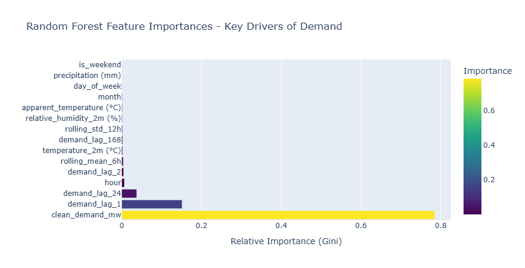

# Predictive Paradox: Systematic Power Grid Demand Forecasting

## 1. Executive Summary
This project develops a highly robust, zero-leakage machine learning pipeline to forecast the hourly electricity demand for the Power Grid Company of Bangladesh (PGCB). The optimized Random Forest Regressor achieves a **Mean Absolute Percentage Error (MAPE) of 3.56%** on a strict chronological hold-out test set.

## 2. Data Engineering & Feature Space
To capture the underlying physical and behavioral drivers of grid demand, the feature space was engineered across three distinct vectors:

### A. Temporal & Localized Behavioral Features
Standard temporal extraction (hour, month, day of week) was applied. The `is_weekend` binary flag was specifically localized to Friday and Saturday to reflect regional working behaviors.

### B. Autoregressive Memory & Momentum
Power grids exhibit massive physical inertia. To capture this, lag features and rolling statistics were engineered without leaking future states:
* **Target:** Next hour demand ($t+1$).
* **Short-term memory:** Lag 1h, Lag 2h.
* **Cyclical memory:** Lag 24h (daily cycle) and Lag 168h (weekly cycle).
* **Momentum:** 6-hour rolling mean and 12-hour rolling standard deviation (shifted by 1 period to prevent intra-window leakage).

### C. Meteorological Integration
Weather is a major contributor to intra-day load variance. High-impact features (`temperature_2m`, `apparent_temperature`, `relative_humidity`, `precipitation`) were merged via index join.

## 3. Methodology & Model Architecture
**The Chronological Split:**
To simulate a true production environment and prevent look-ahead bias, standard K-Fold CV and random splitting were strictly avoided. A chronological threshold (`2024-01-01`) was utilized, isolating all 2024 data into an untouched, out-of-sample hold-out set.

**Model Selection & Optimization:**
A `RandomForestRegressor` was selected as the baseline for its resistance to overfitting and non-linear feature mapping capabilities. To push performance beyond the baseline, hyperparameter tuning was executed using a `TimeSeriesSplit` cross-validator to preserve temporal integrity during optimization. 

The grid search settled on a heavily regularized ensemble to prevent learning historical noise:
* `n_estimators`: 400
* `max_depth`: None
* `min_samples_leaf`: 2
* `max_features`: 0.8

*Note: Restricting `max_features` to 80% forced the decision trees to distribute their learning, reducing over-reliance on the dominant `demand_mw` parameter and uncovering deeper weather correlations.*

## 4. Results & Feature Importance
* **Optimized Random Forest MAPE:** 3.56%

### Key Drivers of Grid Demand

An analysis of the Random Forest feature importances reveals the hierarchy of factors driving Bangladesh's grid demand:

1.  **Grid Inertia (`clean_demand_mw`):** As expected in classical time-series forecasting, the immediate prior state of the grid holds the heaviest mathematical weight. It acts as a highly accurate persistence baseline.
2.  **Cyclical Behavior (`demand_lag_24` & `hour`):** The model heavily relies on the 24-hour lag and the specific time of day to correctly adjust the slope of the persistence baseline, capturing the distinct morning ramps and evening peaks.
3.  **Weather Impact:** The optimized model successfully integrated `temperature` and `relative_humidity` as actionable signals, proving it learned the physical relationship between tropical heat, humidity, and the grid's resulting cooling load.

## 5. Conclusion
This pipeline successfully maps a temporal forecasting problem into a supervised learning matrix with strictly zero data leakage. The resulting 3.56% error rate proves the structural validity of the engineered features, demonstrating a clear, quantitative understanding of both the mathematical algorithms and the real-world physics of the power grid.